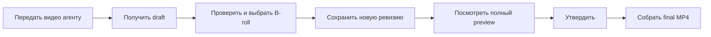

# Монтаж от видео до готового MP4

Эта инструкция для человека, который не хочет разбираться в коде. Большую часть работы делает
Claude Code или Codex. Вы выбираете смысл, B-roll и финальную версию ролика.



## 1. Один раз установить движок

Передайте агенту этот запрос:

> Установи AutoMontage-Agent, выполни `npm ci`, установи локальный faster-whisper и проверь
> окружение командой `npm run doctor`. Не используй платные API.

Для работы нужны Node.js 20+, Python 3 и FFmpeg. Для поиска B-roll нужен интернет. Для основного
монтажа отдельные API-ключи не требуются.

## 2. При желании включить поиск Pexels

Pexels нужен только для поиска готовых фото и видео. Без него остаются ручной импорт, Whisper,
Review, preview и render.

1. Получите бесплатный ключ на [странице Pexels API](https://www.pexels.com/api/).
2. В корне AutoMontage-Agent скопируйте `.env.example` в `.env`.
3. В локальном `.env` заполните только эту строку:

   ```dotenv
   PEXELS_API_KEY=ваш_ключ
   ```

4. Не отправляйте ключ в чат и не добавляйте `.env` в Git.
5. Перезапустите Review после изменения `.env`.

Ключ читает локальный сервер. Браузер, Remotion, монтажный лист и публичный Git-репозиторий его
не получают.

## 3. Передать видео агенту

Можно использовать такой запрос:

> Собери lesson-ролик под ключ из `<имя-видео>.mp4`. Сохрани формат и FPS исходника. Локально
> расшифруй речь, подготовь draft, открой Review для проверки и не утверждай ролик без меня.

Агент создаст отдельную папку `projects/<id>/`. В ней хранятся исходник, транскрипт, версии
монтажного листа, B-roll, preview и final. Папка локальная и не попадает в Git.

## 4. Проверить draft

Агент откроет Review Workbench командой:

```bash
automontage review --project-dir projects/<id> --edit
```

Вверху находятся два разных плеера:

- **ИСХОДНИК** показывает речь и помогает ставить границы сцен;
- **СМОНТИРОВАННЫЙ ПРЕДПРОСМОТР** показывает настоящий результат Remotion с графикой и B-roll.

Проверьте начало и конец сцен, заголовки, крупность спикера и места для B-roll. Красная ошибка в
Диагностике должна быть исправлена. Подсказка сама по себе не блокирует работу.

## 5. Выбрать B-roll

В разделе **B-ROLL** найдите нужную сцену.

1. Прочитайте цель кадра и исходную фразу.
2. При необходимости измените русский и английский поисковые запросы.
3. Выберите **Видео** или **Фото**, ориентацию, размер и минимальную длительность.
4. Нажмите **Подобрать B-roll**.
5. Посмотрите карточки, автора, источник, лицензию, размер и короткий preview.
6. Нажмите **Выбрать** только у одного подходящего материала.
7. Дождитесь сообщения **Медиа добавлено**.

Полный файл скачивается только после выбора. Строка состояния показывает прошедшее время.
Большое видео может несколько минут проходить загрузку, decode, нормализацию и OCR. Повторно
нажимать **Выбрать** в это время не нужно.

Если Pexels не подходит, нажмите **Не подходит** или **Ещё варианты**. Можно также нажать
**Добавить медиа** и выбрать собственный локальный файл.

## 6. Настроить выбранное видео

Для изображения выберите:

- **Заполнить кадр** - весь экран заполнен, края могут обрезаться;
- **Вписать целиком** - виден весь файл, по краям могут остаться поля.

Для видео дополнительно:

1. Найдите нужный старт в маленьком плеере.
2. Нажмите **Начать с текущего места**.
3. Проверьте используемый интервал.
4. Выберите `cover` или `contain`.
5. Оставьте безопасный режим **Без звука**, если звук самого B-roll не нужен.

Режимы **Тихо поверх голоса** и **Вместо голоса** используйте только после прослушивания.

## 7. Проверить текст и логотипы

Tesseract локально проверяет изображение или три кадра видео. Если найден текст, Review покажет
его и заблокирует approval до решения.

- Если текст случайный, чужой или мешает ролику, выберите другой материал.
- Если текст нужен намеренно, сначала посмотрите его в плеере выбранного материала, затем включите
  **Разрешить встроенный текст**.
- Если OCR показывает `unavailable`, осмотрите материал вручную и затем разрешите встроенный
  текст либо выберите другой файл.
- Даже при статусе `clear` проверьте логотипы глазами: OCR не даёт абсолютной гарантии.

## 8. Сохранить монтаж

Нажмите **Сохранить** и подтвердите список правок. Появится новая неизменяемая ревизия, например
`v03-draft`.

**Сохранить не означает собрать видео.** Эта кнопка записывает новый монтажный лист. Старые
версии не удаляются.

## 9. Посмотреть настоящий результат

После Save:

1. Для быстрой необязательной проверки выберите изменённую сцену и нажмите
   **Preview фрагмента**.
2. Затем обязательно нажмите **Полный preview**.
3. Дождитесь окончания сборки.
4. Смотрите результат в верхнем правом плеере **СМОНТИРОВАННЫЙ ПРЕДПРОСМОТР**.
5. Проверьте весь ролик со звуком, особенно переходы до и после B-roll.

Если после Save показывается старое видео, ориентируйтесь на номер ревизии и подпись
**УСТАРЕЛ**. Нажмите **Полный preview** и дождитесь новой сборки.

## 10. Утвердить и собрать final

Когда полный preview проверен:

1. Включите **Я посмотрел полный preview**.
2. Нажмите **Утвердить**.
3. После появления approved-ревизии попросите агента собрать final render и выполнить QA.

Поиск, выбор, импорт и Save никогда не утверждают ролик автоматически. Final render принимает
только approved-ревизию с проверенными локальными файлами.

## 11. Где искать результат

В папке `projects/<id>/`:

- `brief/` - все draft и approved монтажные листы;
- `assets/broll/` - локально проверенный B-roll;
- `previews/` - черновые Remotion-preview;
- `renders/` - версии финальных рендеров;
- `final/` - выбранный итоговый MP4;
- `project.json` - указатель на текущие ревизии.

## Частые проблемы

| Что видно | Что делать |
|---|---|
| Pexels просит ключ | Заполнить `PEXELS_API_KEY` в локальном `.env` и перезапустить Review |
| Ключ есть, но поиск возвращает ошибку | Проверить интернет, VPN и DNS; безопасный загрузчик отклоняет приватные и подменённые адреса |
| Долго написано «Загружаем» | Смотреть счётчик времени и дождаться decode/OCR; не нажимать выбор повторно |
| После Save нет нового B-roll в верхнем плеере | Нажать **Полный preview**: Save сохраняет draft, но не рендерит видео |
| Кнопка approval неактивна | Заполнить все B-roll-сцены, обработать OCR-предупреждения и посмотреть полный preview |
| Видео кандидата не играет | Выбрать другой вариант или использовать фото; полный файл ещё не скачан |
| Импорт фото сообщает о WebP | Установить полную сборку FFmpeg и задать `AUTOMONTAGE_FFMPEG_DIR` |

Подробное описание каждой кнопки находится в [Review Workbench](REVIEW-WORKBENCH.md), а команды
проверки готового MP4 - в [TESTING.md](../TESTING.md).
