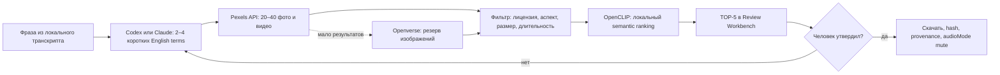

# TOP-3 инструментов для поиска B-roll

Дата проверки: 7 сентября 2026 года.

## Короткий ответ

Лучшее решение - не один «волшебный скрапер», а связка из трёх ролей:

1. **MoneyPrinterTurbo** - взять как проверенный образец всей логики поиска и загрузки.
2. **Pexels API + официальный JavaScript SDK** - использовать как основной легальный источник фото и видео.
3. **OpenCLIP** - локально переранжировать кандидатов по смыслу фразы из транскрипта.

Это важное различие: Pexels приносит товар со склада, OpenCLIP выбирает наиболее подходящий кадр, а MoneyPrinterTurbo показывает, как надёжно собрать конвейер вокруг них.

## Почему именно эта тройка

| Место | Решение | Роль | Балл | Главный риск |
|---:|---|---|---:|---|
| 1 | [MoneyPrinterTurbo](https://github.com/harry0703/MoneyPrinterTurbo) | образец end-to-end pipeline | 88/100 | нельзя копировать целиком; provenance нужно усилить лицензией и датой |
| 2 | [Pexels API](https://www.pexels.com/api/documentation/) + [официальный JS SDK](https://github.com/pexels/pexels-javascript) | основной источник | 83/100 | нужен бесплатный API key и обязательный live acceptance test |
| 3 | [OpenCLIP](https://github.com/mlfoundations/open_clip) | локальный semantic reranker | 83/100 | модели тяжёлые; лицензия конкретных weights проверяется отдельно |

### 1. MoneyPrinterTurbo

На момент проверки: примерно 121 тыс. GitHub stars, 18,7 тыс. forks, MIT, свежий релиз `v1.3.6` от 2 сентября 2026 года и зелёный основной CI.

Внутри есть почти точное решение нашей задачи:

- агент превращает сценарий в короткие английские stock-запросы по 1–3 слова;
- адаптеры ищут видео в Pexels, Pixabay и Coverr;
- кандидаты фильтруются по ориентации, длительности и разрешению;
- работают кэш, дедупликация, скачивание и запись provider/source/creator/rendition;
- тесты проверяют TLS, ошибки провайдера, кэш, порядок загрузки и metadata.

Что брать: форму `generate_terms`, provider adapters, фильтрацию, cache/dedupe и source record. Что не брать: весь генератор роликов и его внешние LLM-вызовы. В AutoMontage поисковые термы создаёт текущий Codex/Claude по локальному транскрипту - отдельный AI API key не нужен.

Недостаток: текущая source-запись MoneyPrinterTurbo хранит источник и автора, но не фиксирует явные `license`, `licenseUrl` и `retrievedAt`. Для AutoMontage эти поля обязательны.

### 2. Pexels API и официальный SDK

Pexels - лучший основной источник, потому что одним документированным API закрывает фото и видео. Поиск умеет query, orientation, size и locale, включая `ru-RU`; современный video endpoint - `/v1/videos/search`.

Официальные условия разрешают бесплатно использовать и изменять фото/видео; атрибуция не обязательна, но рекомендуется. При этом нельзя перепродавать материал без изменений, подразумевать одобрение брендом/человеком или строить конкурирующую stock-площадку. Поэтому AutoMontage всё равно должен сохранять source page и автора - это и этично, и помогает аудиту проекта.

Базовые лимиты документации: 200 запросов в час и 20 000 в месяц; увеличение можно запросить. В этой проверке ключ не использовался: десять анонимных запросов ожидаемо вернули 401. Перед разработкой нужен отдельный live-тест качества на наших десяти фразах.

Интеграция минимальна: небольшой Node.js provider через официальный SDK или прямой REST. Не нужен scraper, cookies или браузерная сессия.

### 3. OpenCLIP

OpenCLIP не скачивает медиа. Он локально отвечает на более ценную задачу: какой из найденных кадров лучше всего иллюстрирует конкретную реплику.

Предлагаемый режим:

- для фото считать embedding миниатюры;
- для видео взять 3–5 preview-кадров;
- сравнить их с исходной фразой и коротким английским запросом;
- отсортировать 20–40 кандидатов и показать человеку лучшие 5.

Репозиторий зрелый и активный: около 14 тыс. stars, MIT, свежий релиз `v3.3.0` от 27 февраля 2026 года и рабочий CI. Для русских фраз нужен мультиязычный SigLIP2/WebLI checkpoint. Код MIT, но карточку/лицензию выбранных model weights нужно сохранить отдельно.

OpenCLIP не устанавливался в ходе исследования: это потянуло бы PyTorch и крупные веса. Сначала стоит сделать маленький benchmark 2–3 моделей на уже скачанных thumbnails.

## Рекомендуемый конвейер



MoneyPrinterTurbo в этой схеме не запускается как отдельный сервис. Его проверенные решения переносятся точечно в provider-модуль AutoMontage.

## Что сохранять рядом с каждым B-roll

Будущий manifest должен содержать минимум:

```json
{
  "queryOriginal": "робот-пылесос объезжает мебель",
  "queryEnglish": ["robot vacuum", "smart home cleaning"],
  "provider": "pexels",
  "assetId": "provider-id",
  "sourceUrl": "public source page, not only CDN URL",
  "author": {"name": "...", "profileUrl": "..."},
  "license": {"name": "Pexels License", "url": "https://www.pexels.com/license/"},
  "retrievedAt": "ISO-8601 timestamp",
  "mediaType": "video",
  "duration": 8.4,
  "dimensions": {"width": 1920, "height": 1080},
  "orientation": "landscape",
  "audioMode": "mute",
  "sha256": "..."
}
```

CDN-ссылка сама по себе недостаточна: она может протухнуть и не объясняет, кто автор и на каких условиях используется файл.

## Практический тест

Тестировались десять типов фраз: предмет, действие, бизнес-абстракция, интерфейс, российский контекст, человек, вертикаль, горизонталь, иллюстрация и сцена без людей.

- Openverse вернул результаты на 10/10 коротких запросов, но качество абстрактных и smartphone-запросов было неровным. Фильтр коммерческого использования и модификации работает.
- Wikimedia API даёт сильный provenance и видео, но semantic stock-поиск слабый.
- Pexels нельзя честно оценить без ключа: 10/10 анонимных запросов вернули 401.
- Реально скачаны и проверены разрешённые JPEG 1024×768 и WebM 1920×1080, 10.459 s. API-ключи и платные сервисы не использовались.

### Найденный блокер внутри AutoMontage

Реальный путь импорта сейчас не проходит до конца, хотя unit-тесты показывают `66 passed, 1 skipped`:

- JPEG сохраняется как `upload.bin`, после чего `ffprobe` не определяет формат без расширения;
- WebM успешно распознаётся, но bundled `ffmpeg` падает на текущей filter-строке `fps=25,pad=...`.

Это не проблема выбранной тройки. Это пробел между mock-тестами и реальным импортом AutoMontage. До интеграции источника нужен отдельный regression fix с настоящими маленькими JPEG/WebM fixtures.

Полный проектный прогон подтвердил связь с реальным ffmpeg-путём: `npm test` завершился с
`814 passed`, `8 skipped`, `3 failed`. Все три fail-счётчика относятся к одной группе
`real review CLI waits for real ffmpeg cleanup before signal exit`: два дочерних сценария
SIGINT/SIGTERM и их родительская группа; причина - `real ffmpeg child never started`.
Документационные изменения не затрагивают исполняемый код, но называть весь suite зелёным нельзя.

## Сильные варианты, которые не вошли

- [Openverse](https://github.com/WordPress/openverse) - лучший резерв открытых изображений, но не даёт видео и предупреждает, что сведения о лицензии нужно независимо проверять.
- [VideoSeek](https://github.com/6v17/VideoSeek) - правильная идея локальной видеотеки и agent API, однако проект молодой, Windows-first, а свежий CI при проверке был красным.
- [FireRed-OpenStoryline](https://github.com/FireRedTeam/FireRed-OpenStoryline) - близок к задаче, но использует deprecated Pexels `/videos/search` и не сохраняет полный provenance.
- [InternVideo](https://github.com/OpenGVLab/InternVideo) - сильный research engine, но слишком тяжёлый и не является интернет-источником.
- [yt-dlp](https://github.com/yt-dlp/yt-dlp) - очень зрелый downloader, но скачивание технически доступного видео не даёт права использовать его как B-roll.

## Решение

Для первой версии не нужен универсальный web-scraper. Нужен официальный Pexels provider, точечно адаптированные паттерны MoneyPrinterTurbo и локальный OpenCLIP reranker. Openverse оставить резервом для изображений.

Исследование на этом останавливается. Установка моделей, добавление API key, изменение схемы manifest и исправление импортера - отдельная реализация после согласования.

## Проверенные источники

- MoneyPrinterTurbo: [README](https://github.com/harry0703/MoneyPrinterTurbo/blob/main/README-en.md), [material provider code](https://github.com/harry0703/MoneyPrinterTurbo/blob/main/app/services/material.py), [releases](https://github.com/harry0703/MoneyPrinterTurbo/releases)
- Pexels: [API documentation](https://www.pexels.com/api/documentation/), [license](https://www.pexels.com/license/), [official JavaScript SDK](https://github.com/pexels/pexels-javascript)
- OpenCLIP: [repository and model documentation](https://github.com/mlfoundations/open_clip)
- Openverse: [API client documentation](https://docs.openverse.org/packages/js/api_client/index.html), [license caveat](https://docs.openverse.org/_preview/2205/api/reference/made_with_ov.html)
