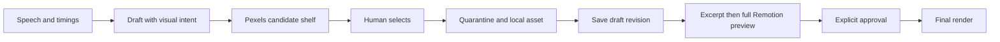

# B-roll search in Review Workbench

Date: 2026-09-08. Status: implemented; final verification recorded in the implementation plan.
Base: origin/main at 0e8c5b3 (v1.5.0). The two 2026-09-07 research documents are preserved; their completed research tasks are not an implementation checklist.

## Product contract

Speech editing and source timings precede scene design. The current agent prepares a lesson draft from the local transcript, including visual intent and a short English stock query. Review searches official Pexels photo/video endpoints and shows a candidate shelf. The human selects a candidate; only that full rendition is downloaded, quarantined, decoded, normalized and hashed. Selection uses the existing replace-broll command. Save publishes a new immutable draft. Excerpt preview is optional; a current full Remotion preview and explicit viewing confirmation precede explicit approval. Search, selection, download, import and Save never approve or render a final.

## Draft and compatibility

A broll scene requires its existing headings and exactly one media source, or brollIntent when media is unresolved. `brollIntent` contains `goal`, `sourceText`, `queryOriginal`, `queryEnglish` (nonempty bounded strings), optional `semanticDescription`. It may coexist with selected brollMedia in a draft so another search is possible. Source text comes from the transcript, not a separate LLM API. The English query is editable; the server does not invent translations. Draft preview keeps the existing [ B-ROLL ] placeholder. Pending intents fail approval and final render. Approved copies omit brollIntent; provenance retains the query.

Existing brollSrc image briefs and metadata v1/v2 continue to open/render with their existing validation. Existing manual image/video upload retains its behavior and does not automatically assign the file. Discovery requires a new review gate only when a draft contains brollIntent or selected discovery provenance; previously approved projects stay valid.

## Provider and session contract

`createPexelsProvider({apiKey, request})` exposes `search({queryOriginal,queryEnglish,mediaKind,orientation,minDurationSec,minWidth,minHeight,page,signal})`. It returns server-only candidates with provider identity, source page/author/license, dimensions, duration, selected rendition and separate thumbnail/preview URLs. Provider order is the default relevance rank; apply eligibility filters, preserve order, deduplicate provider IDs. Page size 12; return up to 12 cards and a next-page indication. No full rendition download during search.

`createCandidateStore({ttlMs=600000,maxEntries=120,now})` owns opaque random candidate IDs, opaque search IDs, scene index and normalized query per Review server session. A new search for a scene invalidates that scene's previous candidate IDs; More uses a new page/search. Cross-session, expired, rejected, or modified IDs fail closed. Browser models are explicit allowlists: no API key, provider download URL, filesystem path, canonical hash, arbitrary upstream error or raw provider payload.

Edit-only routes:
- `POST /api/broll/search`: current baseRevision/baseHash/manifestHash, sceneIndex, queryOriginal/queryEnglish, mediaKind, orientation, minDurationSec, minWidth, minHeight, page.
- `GET /media/broll-candidate/:candidateId/thumbnail|preview`: token-protected bounded proxy, only current session allowlisted renditions.
- `POST /api/broll/reject`: current searchId and candidateId; removes candidate.
- `POST /api/broll/select`: current base snapshot, sceneIndex, searchId and candidateId; download and import; returns opaque assetId and refreshed state, UI queues replace-broll only after successful import.

All POST routes retain Bearer/Origin/Host/body-size checks. Read-only sessions return 405 and cannot search/proxy/import or change drafts. Concurrent requests have bounded semaphores; candidate generation and base snapshots are rechecked after I/O.

## Remote boundary

One focused transport module uses HTTPS only, exact provider-specific host allowlists, no credentials/nonstandard port/IP literals, redirects limited to three with validation on every hop. Resolve all DNS answers and reject non-public IPv4/IPv6 (loopback/private/link-local/metadata/reserved/mapped addresses); pin validated addresses into the connection lookup while retaining TLS hostname validation. Authorization is sent only to the official API host and never forwarded to media redirects. Do not follow cookies or scrape.

Pexels credentials never enter browser state, errors, URLs or renderer environment. Remotion normally exposes root dotenv values to its rendering browser, so every engine CLI invocation explicitly selects a trusted comment-only public env file. Preview child launch also omits provider credentials from inherited environment. Synthetic-key tests exercise the installed Remotion environment loader, including a legitimate `REMOTION_*` positive case; production keys are never used in fixtures.

Bound header and body time, connect time and caller AbortSignal. Count actual streamed bytes independently of Content-Length; reject oversized declared/actual bodies, truncation and decompression (accept identity encoding only). API JSON cap 2 MiB; thumbnail 5 MiB; preview 32 MiB; selected full image 25 MiB/video 256 MiB, bounded further by existing import limits. Require expected MIME and supported extension, then actual ffprobe codec/container agreement. An untrusted browser never supplies a URL. Selected media goes through the existing owned import pipeline and its disk/process/decode/output quotas. No arbitrary temp paths, no shell commands with remote data.

Proxy only bounded preview renditions; never quietly substitute a full rendition as video preview. Render final media only from normalized local brollMedia.src plus SHA-256. Signed/provider URLs stay server-side.

## Provenance and embedded text

Imported discovery bundles use metadata version 3, extending v2 with `provenance` and `textScan`. Provenance includes provider, providerAssetId, sourcePage, author {name,url}, license {name,url}, queryOriginal, queryEnglish, optional semanticDescription, retrievedAt, rendition {id,width,height,mimeType}. Existing canonical/preview hashes, dimensions, media kind, duration and hasAudio remain authoritative.

Local OCR uses the installed Tesseract executable (Apache-2.0) with local language data, through bounded shell-free argv. No mandatory heavy JS/WASM runtime or language download during Review. Inspect the normalized image or three evenly spaced video frames. Scan output is bounded and records status `clear|needs-review|unavailable`, recognized text, reasons and engine. Any recognized text is conservative `needs-review`, especially URL, foreign alphabet or possible wordmark. OCR cannot reliably recognize every graphical logo; all cards warn about manual text/logo inspection. Missing/failed OCR is `unavailable`, not clear, and requires explicit acknowledgement. Never claim OCR proves absence of logos.

Machine evidence is immutable inside asset.json. User acknowledgement belongs to the selection: scene `brollReview` stores `{assetSha256,scanSha256,allowEmbeddedText:true}` in the saved brief, created server-side from current metadata by `allow-broll-text`. Browser sends only sceneIndex and allow flag, never hashes. This is asset-selection metadata (kept alongside provenance in the brief), not a rewrite of the shared immutable asset. Replacement clears it; Undo restores the previous selection and acknowledgement. Approval rereads evidence, verifies the exact scan and media hashes, and blocks unmatched/missing acknowledgements. Approved copies retain the acknowledgement. Safe clear files do not require per-file approval.

## Full preview and approval

Verified v3 provenance independently requires the gate even when authoring markers are absent; final render also checks policy/receipt for v3 assets. Discovery drafts gain top-level `brollReviewPolicy: "preview-required"` carried through approved copies, so removing brollIntent cannot bypass the gate. Save invalidates viewing confirmation. Preview publication records `briefSha256` for the exact draft bytes parsed for rendering and `sourceSha256` for the source, in addition to existing briefPath/media hash; the fields are optional for legacy manifests. A full preview must match current draft, source/output, full range, and verified bytes. Excerpt/stale/modified preview fails approval. UI starts only the actual `automontage preview` command through an edit-only bounded job interface after Save, displays source separately from mounted preview, and offers `Я посмотрел полный preview` followed by explicit `Утвердить`. Approved `brollApproval: {draftSha256,previewSha256,confirmedAt}` records the full-preview hash and draft hash; external CLI approval accepts the same explicit viewing assertion flag. No timer or playing a thumbnail counts as approval. Existing shared project transaction and compare-and-swap are used at final publication; imported metadata/provenance participates in identity comparisons.

## Threat model

Trust current local agent/user to edit intentional project inputs; do not trust browser payloads, provider payloads, networks/DNS, filenames, media codecs, metadata replacement or concurrent project writers. Protect API secret, local network/files, project integrity, immutable history and explicit approval. Loopback token is a capability, not a general remote login. Local administrator maliciously rewriting code is outside the boundary. Bound resource use; never pass provider strings as executable arguments beyond validated URLs and data.

## OpenCLIP decision experiment

An isolated optional benchmark compares provider order and OpenCLIP top-5 on a small redistributable or locally generated dataset with explicit relevance labels, reporting precision/nDCG, cold/warm time, dependency/weights size and RSS. Verify code and selected weights licenses independently. Without Pexels key, label any alternative corpus exploratory and do not infer Pexels quality. Enable in product only on evidence of useful improvement; otherwise provider relevance stays the default and the benchmark is reproducible outside normal install.

## Acceptance

1. Generated JPEG and real WebM imports pass full decode/normalization regressions; mismatched media still fails.
2. Pending intent opens in read-only/edit Review and actual draft Remotion renders placeholder; approval/final reject it.
3. Mock official API provides photo/video shelf with fields/filters/proxies, no full downloads until Select; local HTTP contract transport verifies every security boundary.
4. SSRF, redirect, spoofed/cross-session/expired candidate, size/MIME/truncation/timeout, missing key and secret leakage regressions pass with legitimate adjacent cases.
5. Select/import/Save uses existing immutable pipeline and commands; manual imports/old metadata remain compatible.
6. OCR image/video sampling, warning, hash-bound acknowledgement, replacement invalidation and approval races pass.
7. Playwright covers the shelf, settings, rejection/more, missing key, read-only, save and preview/approval flow; genuine Remotion E2E reaches approved-only render.
8. Full Node suite, doctor, demo, UI suite, pack/privacy/Gitleaks, reviews and applicable CI checks pass. Every skip is reported. Live Pexels only with an already configured free key.
9. Documentation, plan completion and logical commits are present; worktree clean, no push/release/paid API.
